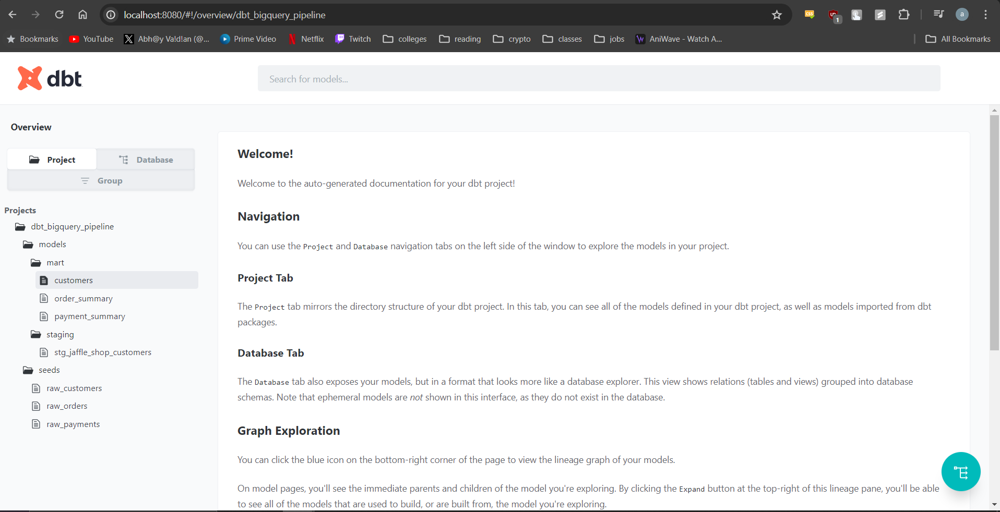

# DBT BigQuery Pipeline

## Overview

This project demonstrates a data pipeline using DBT (Data Build Tool) with BigQuery. It includes models for staging, marts, and seeds to manage and transform data from various sources. The project is designed to clean, aggregate, and summarize customer, order, and payment data from a fictional e-commerce store called Jaffle Shop.

## Model descriptions

models/
 - mart/: Contains models for the mart layer.
   - customers.sql: Model to aggregate customer order data.
   - order_summary.sql: Model to summarize order information.
   - payment_summary.sql: Model to summarize payment information.
 - staging/: Contains models for the staging layer.
   - stg_jaffle_shop_customers.sql: Staging model for customer data.

Setup and Execution
1. Initialize DBT Project
To get started with DBT, you first need to initialize a new project. Run the following command in your terminal:

dbt init dbt-bigquery-pipeline

This command sets up the necessary directory structure and configuration files for your DBT project.

2. Configure BigQuery
Next, you need to configure your DBT project to connect to BigQuery. Follow these steps:

Service Account Setup:

Create a service account in Google Cloud Platform (GCP) with the required permissions for accessing BigQuery.
Download the service account key file in JSON format.
Open the profiles.yml file located in the ~/.dbt/ directory and add the configuration.

3. Add Dataset to BigQuery
Load the dbt-tutorial dataset (including tables like customers, orders, and payments) into your BigQuery project. You can do this by either using the BigQuery web UI or via SQL commands.

4. Create and Deploy Models
DBT models are SQL files where you define your data transformations. Create your models in the models/ directory
models/staging/stg_jaffle_shop_customers.sql

5. Seed Data
I have placed sample data (e.g., raw_customers.csv, raw_orders.csv, raw_payments.csv) in the seeds/ directory. To load these seed files into BigQuery, run:

dbt seed

6. Run Models
Execute the DBT models to transform your data as defined in your SQL files. Use the following command:

- dbt debug
- dbt run

7. Test Models
DBT allows you to define tests in the schema.yml files to ensure data quality. Run these tests using:

- dbt test

8. Generate and Serve Documentation
Generate documentation for your DBT project, including a DAG of your models:

- dbt docs generate

Serve the documentation locally to view it in your browser:

- dbt docs serve
Visit http://localhost:8080 in your browser to view the auto-generated documentation.

## Conclusion
This project demonstrates a complete data pipeline using DBT with BigQuery, including data staging, transformations, and testing to ensure data quality and integrity. It provides a solid foundation for building scalable and maintainable data models.
